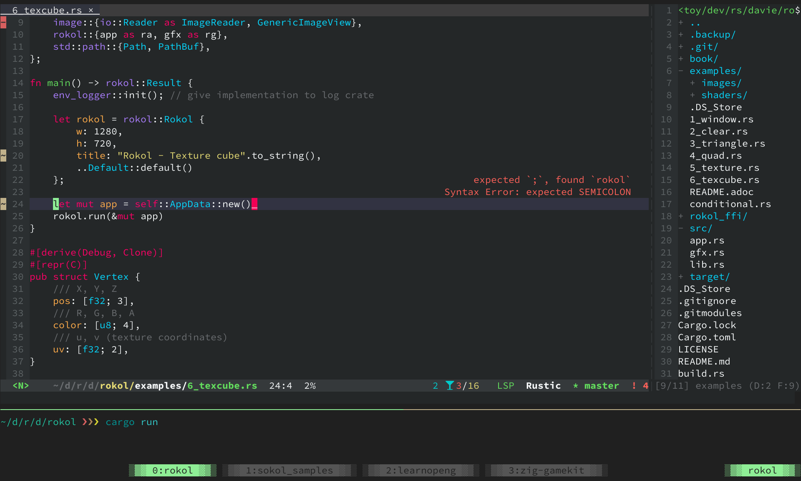

= Evil Emacs in 2020 or 2021
:evil: https://github.com/emacs-evil/evil[Evil]
:posframe: https://github.com/tumashu/posframe[posframe]

_Quick commits for Vimmers to become {evil}_

== Overview

This repostory is for Vimmers to use Emacs as a first-class editor. The latest files are what I'm currently using and not an ultimate solution, but they could be helpful to other Vimmers, so I'm sharing them.

* link:docs/guide.adoc[docs/guide.adoc]
+
10 steps to become evil, consist of 67 commits.

* link:docs/questions.adoc[docs/questions.adoc]
+
Expected questions to become evil.

== Note

=== Environment

I'm on macOS and *I'm not sure about Windows*.

I'm using Emacs on terminal and some fancy packges for GUI such as {posframe} are out of the scope of this repo. But it would be an easy last step for you.

=== Expected questions

* Why would I swtich to Emacs from Vim or NeoVim?
+
Why?
+
For me, I just wanted to try some differnt tool. I still want more :)

* There are many guides out there. Why would I choose this one?
+
This guide is for Vimmers and the commits are made from scratch.

* Are you a master of Emacs?
+
No. I need to learn more.

